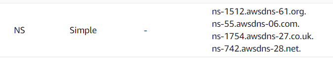
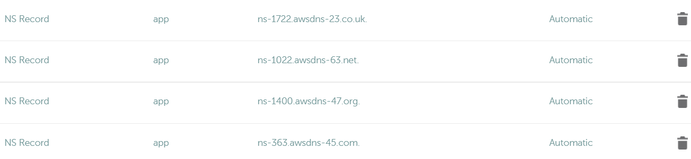

# AWS Guide

&#42; All commands should be run from `express-backend/`

### Requirements
- Obtain AWS credentials for this project
  - Access key ID
  - Secret access key
  - User name
  - Password
  - Region to use
- Install [aws-cli](https://docs.aws.amazon.com/cli/latest/userguide/getting-started-install.html)
  - Configure a profile
  - ```
    aws configure --profile [PROFILE]
    ```

### Basic Deployment (DB + server)

##### Step 1. Make sure you are using the correct aws-cli profile
```
# Check access_key, secret_key and region are correct
aws configure list

# Change default profile if needed
# List profiles
aws configure list-profiles
# Change default (linux)
AWS_DEFAULT_PROFILE=[PROFILE]
# Change default (powershell)
$env:AWS_PROFILE="[PROFILE]"
# Check again that values are correct
aws configure list
```

##### Step 2. Check template is uploaded to S3
Steps:
1. In AWS, go to `S3 > Buckets`
2. Select a bucket (or create a bucket)
3. Upload `cloudformation-ecs-elb-subdomain.yml` file
4. Copy `Object URL` of the file for next step

##### Step 3. Set the variables defined in this files
- If main domain is `domain.com`, you can use `SUBDOMAIN_NAME=app.domain.com`
```
# Check this files
.
├── AWS/
│    └── scripts/
│         ├── linux/
│         │     └── setup-names.sh
│         └── powershell/
│               └── setup-names.ps1
└── .github
      └── workflows
            ├── production.yml
            └── sandbox.yml
```

##### Step 4. Create the cloudformation stack
<details>
  <summary>Linux/MacOS commands</summary>

    # This should be run on /express-backend directory
    source ./AWS/scripts/linux/setup-names.sh
    ./AWS/scripts/linux/setup.sh
</details>

<details>
  <summary>Powershell commands</summary>

    # This should be run on /express-backend directory
    .\AWS\scripts\powershell\setup-names.ps1
    .\AWS\scripts\powershell\setup.ps1 
</details>

In AWS, you can see the status in `CloudFormation > Stacks > [The stack] > Resources`.

##### Step 5. Update External DNS
In AWS console:
1. Go to `Rute 53 > Hosted Zones`
2. Open the hosted zone for this project (This is created by cloudformation)
3. Create a new `NS` record in the external DNS provider for each of the ones that appear.<br>
Example in AWS:

Example in NameCheap:


##### Step 6. Update github actions secrets
First obtain credentials from `Secrets Manager`, then save them in repository
1. In AWS, go to `Secrets Manager > Secrets`
2. Open the secret corresponding to the github actions
3. In the github repository, go to `Settings > Secrets > Actions > Repository secrets`, then save:
   1. `AWS_ACCESS_KEY_ID`
   2. `AWS_SECRET_ACCESS_KEY`

##### Step 7. Run github actions to update ECS
1. Wait for all of cloudfront to finish.
2. Push a new commit to master/sandbox to run the deployed github action
   1. Alternatively, in the github repository.
      1. Go to `Actions`.
      2. Select last action for production/sandbox
      3. Click `Re-run all jobs`

##### Step 8. Change desired count of ECS to 1
Initially the desired count is set to 0. This means that no docker instances will run. That makes sense initially because we had no docker image to run.

```
# Linux
aws ecs update-service --desired-count 1 \
  --cluster ${APP_NAME}cluster \
  --service ${APP_NAME}service
# Powershell
aws ecs update-service --desired-count 1 `
  --cluster ${env:APP_NAME}cluster `
  --service ${env:APP_NAME}service
```

##### Step 9. sandbox deployment
Repeat steps 3-5 and 7-8 with different:
- APP_NAME
- DB_ROOT_PASSWORD
- SUBDOMAIN_NAME
  - Can use `app.sandbox` prefix
- AWS_REGION (if needed)
  - Also change it in AWS cli (`aws configure --profile [PROFILE]`)
  
### Notes
- Whenever the `env/.env` file is updated, the secret in AWS `Secrets Manager` has to be updated too.